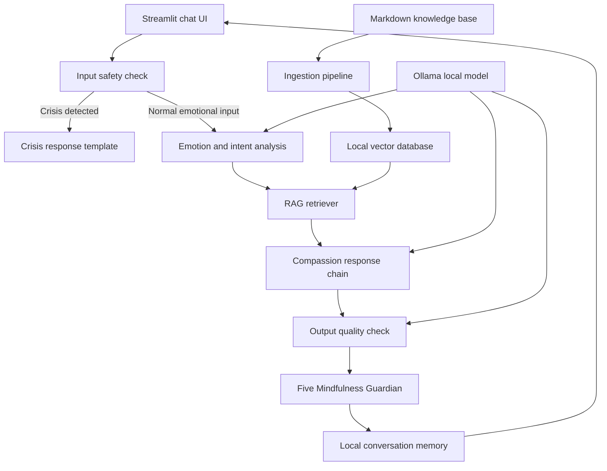

# Avaloka AI Plan-to-Module Map

This file maps each implementation-plan task to the system module it builds or verifies.

Related files:

- Design spec: `docs/superpowers/specs/2026-05-06-avaloka-ai-mvp-design.md`
- Implementation plan: `docs/superpowers/plans/2026-05-06-avaloka-ai-mvp.md`

## System Modules

## Task Mapping

| Plan Task | Files | Primary System Module | Secondary Modules | What It Establishes |
|---|---|---|---|---|
| Task 1: Project Skeleton and Dependencies | `pyproject.toml`, `.gitignore`, `app/__init__.py`, `app/config.py` | Foundation | All modules | Creates the Python package, dependency baseline, and shared local settings used by every module. |
| Task 2: Safety Layer | `app/security.py`, `tests/test_security.py` | Input safety check | Crisis response template | Ensures crisis and prompt-injection routing happens before RAG or LLM generation. |
| Task 3: Seed Knowledge Corpus and Loader | `app/knowledge.py`, `data/knowledge_base/*.md`, `tests/test_knowledge.py` | Markdown knowledge base | RAG retriever | Creates the first emotionally tagged Buddhist-informed corpus and the loader that validates it. |
| Task 4: Ingestion and Retrieval | `app/ingest.py`, `app/retriever.py` | Ingestion pipeline, Local vector database, RAG retriever | Markdown knowledge base | Converts Markdown passages into vector-searchable chunks and retrieves source-aware passages for user pain points. |
| Task 5: Emotion Analyzer | `app/emotion.py`, `tests/test_emotion.py` | Emotion and intent analysis | Compassion response chain | Classifies the user's emotional scenario, main emotion, intensity, and immediate support need. |
| Task 6: Compassion Response Chain | `app/prompts.py`, `app/chain.py`, `tests/test_chain.py` | Compassion response chain | Input safety check, RAG retriever, Ollama local model | Orchestrates safety, emotion analysis, retrieval, prompt construction, and LLM response generation. |
| Task 6A: Five Mindfulness Guardian | `app/mindfulness_guardian.py`, `tests/test_mindfulness_guardian.py`, `app/chain.py`, `tests/test_chain.py` | Five Mindfulness Guardian | Output quality check, Compassion response chain | Checks every generated answer against respect for life, true happiness, true love, loving speech, and nourishment before display. |
| Task 7: Local Memory | `app/memory.py` | Local conversation memory | Streamlit chat UI, Compassion response chain | Stores sanitized local conversation records with emotion tags, scenario labels, and source titles. |
| Task 8: Streamlit UI | `app/ui.py` | Streamlit chat UI | Compassion response chain, Local conversation memory, RAG source display | Provides the user-facing chat interface, clear-history control, and collapsed wisdom-source section. |
| Task 9: Golden Test Set | `tests/golden_cases.yaml`, `tests/test_golden_cases.py` | Evaluation layer | All modules | Defines behavioral acceptance cases for emotional support, crisis handling, prompt injection, and karma-boundary prompts. |
| Task 10: End-to-End Local Verification | `docs/evaluation.md` | Full system verification | All modules | Confirms the complete local loop works from user input to safety routing, retrieval, response, UI display, and memory. |

## Module Build Order

The implementation order intentionally follows the risk profile of the product:

1. **Foundation**: Task 1 creates the project structure and shared settings.
2. **Safety before intelligence**: Task 2 ensures dangerous inputs never reach normal generation.
3. **Grounded wisdom before personality**: Tasks 3-4 create and retrieve the small curated corpus.
4. **Emotional understanding before response**: Task 5 gives the chain structured emotional context.
5. **Compassion chain**: Task 6 connects safety, emotion analysis, retrieval, and the local LLM.
6. **Ethical output guard**: Task 6A ensures answers do not break the Five Mindfulness Trainings before the user sees them.
7. **Continuity**: Task 7 adds local memory after the core response behavior exists.
8. **User experience**: Task 8 exposes the system through a quiet Streamlit chat interface.
9. **Acceptance testing**: Tasks 9-10 verify that the system behaves correctly across normal, crisis, injection, mindfulness, and boundary cases.

## Critical Path

The smallest useful Avaloka prototype requires these modules in order:

1. Task 1: Project Skeleton and Dependencies.
2. Task 2: Safety Layer.
3. Task 3: Seed Knowledge Corpus and Loader.
4. Task 4: Ingestion and Retrieval.
5. Task 5: Emotion Analyzer.
6. Task 6: Compassion Response Chain.
7. Task 6A: Five Mindfulness Guardian.

After Task 6A, Avaloka can be tested from code without a UI while still enforcing Buddhist ethics at the final output boundary. Tasks 7-10 make it usable, persistent, and verifiable as a local product.

## Cross-Cutting Concerns

### Safety

Primary task: Task 2.

Also touched by:

- Task 6, because the response chain must short-circuit crisis and prompt-injection inputs.
- Task 9, because golden cases define safety expectations.
- Task 10, because manual acceptance prompts verify safety routing in the running app.

### Buddhist Grounding

Primary tasks: Task 3 and Task 4.

Also touched by:

- Task 6, because the compassion prompt must use retrieved wisdom without sounding like a lecture.
- Task 8, because source passages are shown in the collapsed "Wisdom basis" section.
- Task 9, because hallucination and karma-boundary cases test whether Buddhist framing stays grounded.

### Emotional Companion Quality

Primary tasks: Task 5 and Task 6.

Also touched by:

- Task 3, because corpus tags are organized around emotional scenarios.
- Task 7, because memory gives the companion continuity.
- Task 9, because golden cases check tone, empathy, and actionability.

### Local Privacy

Primary task: Task 7.

Also touched by:

- Task 1, because local paths are centralized and private data folders are ignored by git.
- Task 8, because the UI exposes clear-history behavior.
- Task 10, because local verification confirms data stays on the machine.
