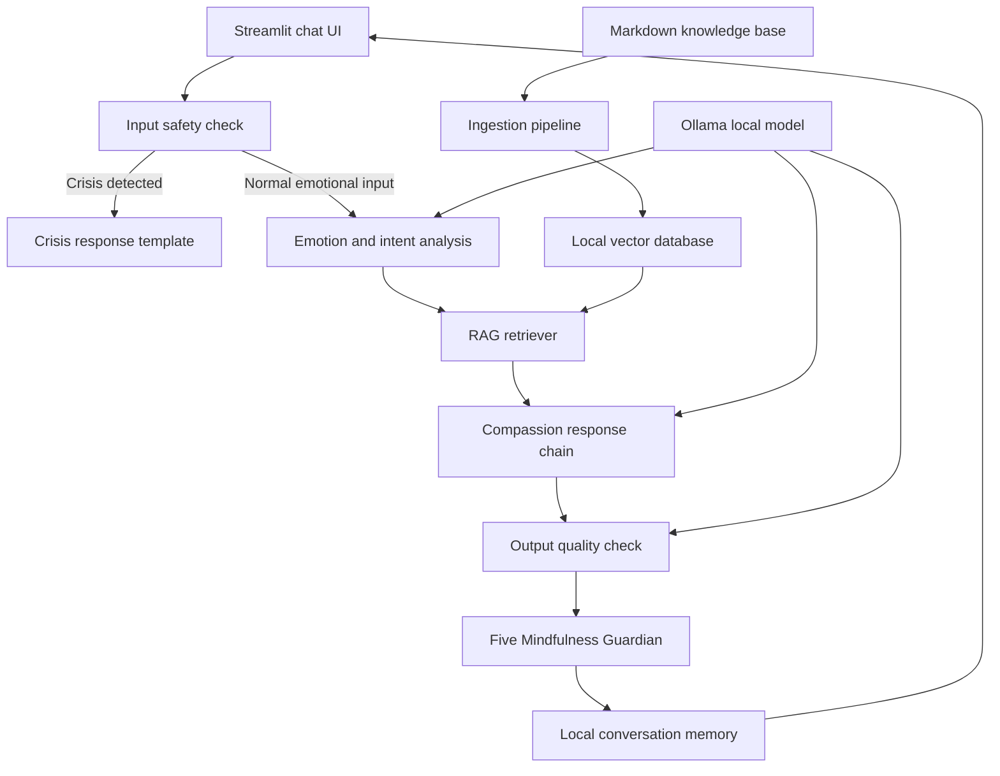

# Avaloka AI System Modules Explained

This document explains what each module in the Avaloka AI system diagram is responsible for, what problem it solves, and why it exists.

## Big Picture

Avaloka AI v1 is not a system where a large language model directly answers the user.

It is a controlled local pipeline:

```text
User input
-> Safety check
-> Emotion understanding
-> Buddhist wisdom retrieval
-> Compassionate response generation
-> Output quality check
-> Five Mindfulness Guardian
-> Local memory
-> Chat UI
```

The purpose of this pipeline is to keep Avaloka safe, grounded, warm, and private. Each module exists to prevent the local model from freely improvising in a sensitive emotional-support context.

## System Diagram



## 1. Streamlit Chat UI

### What Problem It Solves

The user needs a quiet, simple, private place to express what they are feeling.

### Purpose

The Streamlit UI is the visible product surface. It receives the user's message, displays Avaloka's response, shows conversation history, and gives the user a way to clear local records.

It is not the core intelligence. It is the entrance and experience layer.

### Responsibilities

- Receive user input.
- Display Avaloka's response.
- Show local conversation history.
- Provide a clear-history action.
- Optionally show retrieved source passages in a collapsed section.
- Present crisis responses in a distinct, calm way.

## 2. Input Safety Check

### What Problem It Solves

Users may express self-harm, suicidal ideation, intent to harm others, or attempts to override the system's hidden instructions.

### Purpose

The safety check decides whether the input is allowed to enter the normal Avaloka flow.

This module must run before RAG retrieval and before any model generation. Safety cannot depend only on the model making the right decision later.

### Responsibilities

- Detect self-harm or suicidal language.
- Detect intent to harm others.
- Detect severe crisis language.
- Detect prompt-injection attempts.
- Route dangerous inputs away from normal response generation.

## 3. Crisis Response Template

### What Problem It Solves

When a user may be in immediate danger, ordinary comfort or Buddhist reflection is not enough and may be inappropriate.

### Purpose

The crisis response gives a fixed, warm, direct safety-oriented message.

This is a safety exit from the normal product flow.

### Responsibilities

- Respond with warmth and urgency.
- Encourage the user to contact a real person immediately.
- Mention emergency services or crisis support when immediate danger is present.
- Avoid Buddhist interpretation, karma framing, or spiritual explanations.
- Avoid pretending to be therapy or emergency care.

## 4. Emotion and Intent Analysis

### What Problem It Solves

The user writes natural language, but Avaloka needs to understand what kind of pain is underneath the words.

### Purpose

This module turns the user's message into structured emotional context for the response chain.

For example:

```text
User: "同事抢我功劳，我恨他。"

Analysis:
- Scenario: workplace_hurt
- Primary emotion: anger
- Secondary emotions: hurt, resentment
- Need: grounding
```

### Responsibilities

- Identify the main emotion.
- Identify secondary emotions.
- Classify the scenario.
- Estimate emotional intensity.
- Decide whether the user needs grounding, reflection, or practical next steps.

## 5. RAG Retriever

### What Problem It Solves

Avaloka should not invent Buddhist guidance from the model's memory. It needs relevant local wisdom sources.

### Purpose

The retriever searches the local vector database for passages that match the user's emotional situation.

It gives the response chain a grounded wisdom basis.

### Responsibilities

- Search for emotionally relevant passages.
- Return the top matching wisdom snippets.
- Include source metadata such as title and source.
- Prioritize emotional fit over broad Buddhist knowledge coverage.

## 6. Compassion Response Chain

### What Problem It Solves

Avaloka must combine safety, emotion analysis, retrieved wisdom, memory, and persona rules into one coherent reply.

### Purpose

This is the core orchestration module. It is where Avaloka becomes more than a generic local model.

The response chain tells the model how to answer:

1. Hear the user's pain.
2. Reflect the wound, fear, attachment, or unmet need.
3. Illuminate the situation with Buddhist wisdom in plain language.
4. Offer one immediate practice.

### Responsibilities

- Receive user input after safety approval.
- Use emotion analysis results.
- Use retrieved wisdom passages.
- Build the final model prompt.
- Call the local Ollama model.
- Produce a warm, grounded, non-preachy response.

## 7. Output Quality Check

### What Problem It Solves

Even a good model can sometimes sound preachy, give too much advice, invent citations, or make inappropriate spiritual claims.

### Purpose

The output quality check catches obvious response problems before the answer is shown to the user.

For v1, this can be lightweight. It can start with rule checks and later include model-based review.

### Responsibilities

- Check that the response begins with emotional acknowledgment.
- Detect command-like language such as "你应该" or "你必须".
- Detect too many advice items.
- Detect fabricated or unsupported source claims.
- Detect inappropriate karma or spiritual framing.
- Ensure crisis content never receives normal Buddhist interpretation.

## 8. Five Mindfulness Guardian

### What Problem It Solves

Even if an answer is empathetic and technically safe, it can still break Avaloka's Buddhist ethical promise. It might encourage revenge, shame the user with cold doctrine, create dependency, reinforce escapist consumption, or turn Buddhist language into blame.

### Purpose

The Five Mindfulness Guardian checks the final answer before the user sees it. It protects the product promise that Avaloka does not merely "sound Buddhist," but stays aligned with respect for life, true happiness, true love, loving speech and deep listening, and nourishment and healing.

### Responsibilities

- Block or revise answers that encourage harm, revenge, violence, or dehumanization.
- Block or revise answers that treat wealth, status, control, or punishment as true relief.
- Block or revise answers that encourage coercion, dependency, or boundary-breaking in relationships.
- Block or revise answers that shame the user, dismiss pain, or use cold doctrine.
- Block or revise answers that encourage addictive consumption, rumination, or spiritual bypassing.
- Return a safe fallback grounding practice if revision still fails.

## 9. Local Conversation Memory

### What Problem It Solves

Emotional companionship should not feel like a one-off question-answer session. The user may want Avaloka to remember recurring patterns gently and privately.

### Purpose

The memory module stores minimal local conversation records so Avaloka can provide continuity.

The default should be privacy-preserving: store summaries and tags rather than large amounts of raw sensitive text.

### Responsibilities

- Save local conversation summaries.
- Save emotion tags.
- Save scenario categories.
- Save source titles used in responses.
- Load recent history for future context.
- Let the user clear local history.

## 10. Markdown Knowledge Base

### What Problem It Solves

Avaloka needs reliable, controllable source material shaped around emotional-support use cases.

### Purpose

The Markdown knowledge base is the human-readable wisdom corpus.

For v1, it should be small and hand-curated. It should focus on the five MVP emotional scenarios instead of trying to cover all Buddhist knowledge.

### Responsibilities

- Store source-aware Markdown passages.
- Tag each passage by scenario, emotion, teaching, and practice.
- Keep usage rights notes.
- Provide clean text for ingestion.
- Avoid large, legally unclear, low-quality scraped corpora.

## 11. Ingestion Pipeline

### What Problem It Solves

Human-readable Markdown files cannot be searched semantically by the model unless they are parsed, chunked, embedded, and stored.

### Purpose

The ingestion pipeline converts the Markdown knowledge base into searchable vector data.

### Responsibilities

- Read Markdown files.
- Parse frontmatter metadata.
- Split passages into useful chunks.
- Generate embeddings.
- Store chunks and metadata in the local vector database.

## 12. Local Vector Database

### What Problem It Solves

Avaloka needs fast local semantic search over the wisdom corpus.

### Purpose

The local vector database stores embedded knowledge chunks and retrieves similar passages for a user message.

In the MVP, this is ChromaDB stored on the user's machine.

### Responsibilities

- Store embedded text chunks.
- Store metadata for each chunk.
- Support semantic similarity search.
- Return relevant passages to the RAG retriever.
- Keep data local.

## 13. Ollama Local Model

### What Problem It Solves

Natural, emotionally sensitive language generation requires a large language model, but Avaloka should stay private and local.

### Purpose

Ollama runs the local model on the user's Mac Mini.

The model can support emotion analysis, response generation, and optional output review, while keeping user content on the local machine.

### Responsibilities

- Run the local LLM.
- Generate the final compassionate response.
- Optionally support structured emotion analysis.
- Optionally support output quality review.
- Avoid external API calls.

## How the Modules Work Together

When the user sends a message:

1. The Streamlit UI receives the message.
2. The safety check decides whether normal processing is allowed.
3. Crisis inputs go directly to the crisis response template.
4. Normal inputs go to emotion and intent analysis.
5. The RAG retriever searches for relevant wisdom.
6. The compassion response chain builds a prompt and calls Ollama.
7. The output quality check catches obvious issues.
8. The Five Mindfulness Guardian checks that the answer does not break Buddhist ethical commitments.
9. Local memory stores a privacy-preserving summary.
10. The UI shows the answer and optional source passages.

## Simplest Mental Model

Each layer has one job:

- Safety layer: prevent harm.
- Emotion layer: understand where the user hurts.
- RAG layer: ground the answer in curated wisdom.
- Response chain: make the answer sound like Avaloka.
- Quality layer: prevent preachiness and hallucination.
- Five Mindfulness layer: prevent answers that break respect for life, loving speech, true love, true happiness, or nourishment.
- Memory layer: create continuity.
- UI layer: make the experience usable and calm.

The system diagram is not meant to make the project complicated. It exists to keep a sensitive emotional companion safe, private, grounded, and consistent.
