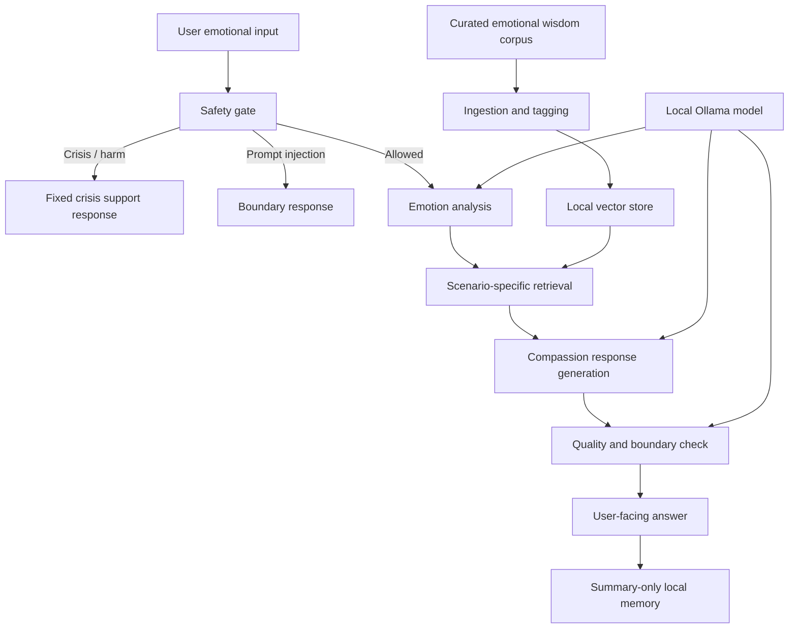

# Avaloka AI CEO Review

Date: 2026-05-12

Review lens: product viability, strategic focus, risk, execution path, and whether the system design serves the business goal.

## Executive Verdict

Avaloka AI is feasible as a private local emotional-companion prototype. It is not yet feasible as a broad consumer mental-health product, a general Buddhist knowledge assistant, or a scalable AI wellness platform.

The strongest first wedge is:

> A private, local, Buddhist-informed emotional companion for reflective users who want a calm place to process workplace stress, relationships, anger, anxiety, and loneliness.

The current MVP direction is mostly correct. The biggest CEO-level risk is not whether the system can be built. It can. The risk is that the product drifts into an unclear middle: not clinically safe enough to be mental health care, not doctrinally authoritative enough to be Buddhist education, and not delightful enough to be a daily companion.

The company-level decision should be:

> Build Avaloka v1 as a narrow, private, emotional-reflection companion. Do not position it as therapy, religious authority, or a general AI assistant.

## Feasibility Rating

| Dimension | Rating | CEO Assessment |
|---|---:|---|
| Technical feasibility | 8/10 | Local LLM + RAG + Streamlit MVP is achievable. |
| Product clarity | 7/10 | The current "private emotional companion" focus is good; must stay narrow. |
| Differentiation | 6/10 | Buddhist-informed local privacy is distinct, but the user promise needs sharper language. |
| Safety and compliance | 5/10 | The design has safety routing, but crisis handling, disclaimers, and evaluation need strengthening before real users. |
| Content/data feasibility | 6/10 | Hand-curated corpus is realistic; copyrighted Buddhist commentary is a risk. |
| Business scalability | 4/10 | Local-first is excellent for trust but harder for distribution, support, analytics, and monetization. |
| Founder-market fit | 8/10 | Strong if the founder deeply cares about contemplative emotional support and can curate the voice. |

Overall:

> Proceed with MVP. Do not commercialize until real user retention, safety behavior, and tone quality are proven.

## What Is Correct in the Current Direction

### 1. The product should be emotional companionship first

The approved direction is correct: Avaloka v1 should only serve private emotional support, not Buddhist encyclopedia Q&A.

This gives the product a clear reason to exist. Users will not come back because Avaloka can define "无常"; they may come back if Avaloka helps them survive a painful evening without spiraling.

### 2. Local-first is a real strategic asset

For emotional journaling and spiritual reflection, privacy is not a small feature. It is part of the trust promise.

Local-first supports:

- Private user disclosures.
- No external API calls.
- No cloud account required.
- A calmer founder-controlled prototype phase.

The tradeoff is weaker distribution and less telemetry. That is acceptable for v1.

### 3. RAG is the right grounding strategy

The system should not depend on the model's memory of Buddhist concepts. A small curated corpus with emotional tags is the correct first move.

The corpus should be built around pain scenarios, not around scriptures.

Wrong corpus shape:

- `金刚经`
- `心经`
- `维摩诘经`
- `普门品`

Better corpus shape:

- "被否定时如何安住"
- "愤怒来时如何不被它带走"
- "失恋执着时如何看见渴望"
- "焦虑时如何把心带回现实下一步"

### 4. Safety-first architecture is mandatory

The current design correctly routes crisis detection before RAG and LLM generation.

This is not optional. A spiritual companion that mishandles self-harm content is not a product problem; it is an existential risk.

## What Needs to Change

### 1. Remove FastAPI from v1

The older roadmap uses Streamlit + FastAPI. The newer MVP design says Streamlit-only first. The CEO decision should be:

> Streamlit-only for v1.

FastAPI adds architecture before there is enough product evidence. Introduce FastAPI only when:

- The response chain passes golden tests.
- Real users validate the experience.
- There is a need for API separation, mobile UI, or multiple frontends.

### 2. Do not use "Buddhist wisdom AI" as the primary user-facing category

"Buddhist wisdom AI" sounds interesting but broad. It may attract users who expect doctrinal authority or religious Q&A.

Better positioning:

> A private reflection companion for difficult emotions, guided by Buddhist wisdom.

This keeps Buddhism as the texture and method, not the product category.

### 3. Make safety and disclaimers product-level, not only backend-level

The current system design has a safety module, but the user experience also needs clear boundaries.

Avaloka should say, quietly and plainly:

- It is not therapy.
- It is not emergency support.
- It does not diagnose.
- In immediate danger, contact emergency services or crisis support.

This should appear in onboarding and crisis responses.

### 4. Treat content rights as a gating risk

Do not ingest modern teacher books or copyrighted commentary into the product without checking rights.

For v1:

- Prefer original summaries.
- Use public-domain or clearly licensed material.
- Keep source inspiration notes.
- Avoid long verbatim passages from modern books.

This is both legal risk management and product quality control.

### 5. Memory should start as opt-in or summary-only

The current design says sanitized summaries by default. That is the right minimum.

CEO recommendation:

> Start with summary-only memory and a visible clear-history control. Add full local journaling only after users explicitly opt in.

Emotional data is sensitive. More memory is not always better.

## Revised System Design Recommendation

The system design should be reframed around risk gates, not technical components.

The most important design change is mental, not technical:

> Avaloka should be designed as a sequence of product risk gates, not as a chat app with RAG attached.

## CEO-Level Product Thesis

Avaloka has a credible thesis if the product proves this:

> In emotionally charged moments, a local Buddhist-informed AI can help reflective users pause, feel understood, and take one wise next step better than generic chatbots.

This thesis can be tested quickly.

It does not require:

- Fine-tuning.
- Large corpus ingestion.
- Mobile app.
- Accounts.
- Cloud deployment.
- Audio.
- Beautiful branding.

It requires:

- High-quality response tone.
- Reliable crisis routing.
- Good retrieval for the top five emotional scenarios.
- A small number of users who return after real emotional moments.

## MVP Kill Criteria

Stop or pivot if, after testing 10-20 real users:

- Users say responses feel preachy, generic, or emotionally distant.
- Users do not return after the first session.
- Crisis and boundary prompts are unreliable.
- RAG sources do not improve response quality.
- The Buddhist framing creates confusion, guilt, or doctrinal arguments.

## MVP Success Criteria

Proceed to v2 if:

- At least 60% of testers say Avaloka helped them feel calmer or clearer.
- At least 30% voluntarily return within seven days.
- Crisis prompts route correctly in 100% of golden tests.
- Prompt-injection and karma-boundary tests pass.
- Users describe the tone as warm, grounded, and non-judgmental.
- Users understand it is not therapy.

## Recommended 30-Day Plan

### Week 1: Build the smallest safe loop

- Streamlit-only app.
- Safety gate.
- Fixed crisis response.
- Five seed documents.
- One local model.
- No memory beyond current session.

Success: user can type one painful prompt and receive a safe, empathetic, grounded response.

### Week 2: Prove retrieval and tone

- Expand corpus to 25-30 passages.
- Add emotion tags.
- Add RAG retrieval.
- Build 30 golden tests.
- Compare baseline prompts with RAG prompts.

Success: RAG improves specificity and reduces generic advice.

### Week 3: Add memory and user feedback

- Add summary-only local memory.
- Add clear-history control.
- Add lightweight feedback: "felt helpful", "too preachy", "not relevant".
- Test with 5 trusted users.

Success: users can see continuity without feeling privacy anxiety.

### Week 4: Decide whether this deserves v2

- Test with 10-20 users.
- Review retention and qualitative feedback.
- Remove features that users do not value.
- Decide v2 direction: local desktop app, mobile companion, or private journaling tool.

Success: clear decision to continue, pivot, or stop.

## Final CEO Recommendation

Build the MVP, but keep the product brutally narrow.

Avaloka should not try to be:

- A therapist.
- A monk.
- A Buddhist encyclopedia.
- A general-purpose AI companion.
- A meditation app.

Avaloka should be:

> A private local companion that helps a person meet painful emotions with steadiness, Buddhist-informed reflection, and one concrete next step.

That is feasible. That is differentiated enough to test. And it is narrow enough to build without losing the soul of the product.

## Sources Checked for Current Assumptions

- Ollama qwen3 model availability: https://ollama.com/library/qwen3
- Ollama qwen3-embedding availability: https://ollama.com/library/qwen3-embedding
- Ollama bge-m3 availability: https://ollama.com/library/bge-m3
- SAMHSA 988 Lifeline funding and usage context: https://www.samhsa.gov/newsroom/press-announcements/20260113/samhsa-announces-231-m-funding-opportunity-administer-988-lifeline
