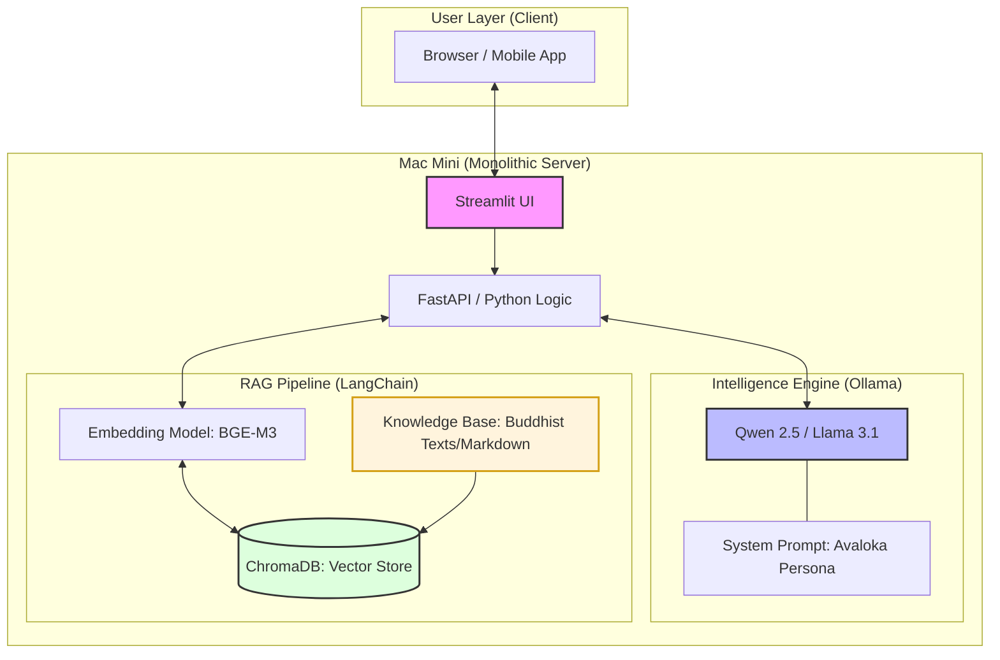

```mermaid
graph TD
    subgraph "User Layer (Client)"
        A[Browser / Mobile App]
    end

    subgraph "Mac Mini (Monolithic Server)"
        B[Streamlit UI] --> C[FastAPI / Python Logic]
        
        subgraph "Intelligence Engine (Ollama)"
            D[Qwen 2.5 / Llama 3.1]
            E[System Prompt: Avaloka Persona]
            D --- E
        end

        subgraph "RAG Pipeline (LangChain)"
            F[Embedding Model: BGE-M3]
            G[(ChromaDB: Vector Store)]
            H[Knowledge Base: Buddhist Texts/Markdown]
        end

        C <--> F
        F <--> G
        H --> G
        C <--> D
    end

    A <--> B

    %% 样式美化
    style B fill:#f9f,stroke:#333,stroke-width:2px
    style D fill:#bbf,stroke:#333,stroke-width:2px
    style G fill:#dfd,stroke:#333,stroke-width:2px
    style H fill:#fff4dd,stroke:#d4a017,stroke-width:2px
```