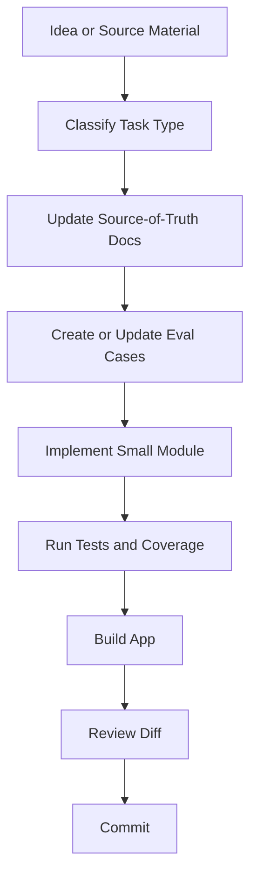

# Agentic Coding Workflow For Avaloka

Status: Active engineering workflow  
Audience: Avaloka founder, Codex agents, future implementation agents  
Purpose: Move Avaloka development from vibe coding to agentic coding.

## 1. Why This Exists

Avaloka is not a casual prototype anymore. It has:

- product direction
- user validation evidence
- safety gates
- Buddhist/secular wisdom knowledge layers
- eval cases
- a local MVP
- tests and coverage

That means the project should not be built by asking an AI to "just add a feature" and accepting whatever comes back.

Avaloka should use agentic coding:

> The human owns intent, taste, product judgment, and safety.  
> The agent owns bounded execution, tests, documentation updates, and verification.

## 2. Vibe Coding vs Agentic Coding

| Mode | What happens | Why it is risky for Avaloka |
|---|---|---|
| Vibe coding | The human gives a loose prompt, the AI changes code, the result is accepted if it looks okay. | Safety boundaries drift, docs fall behind, response quality becomes inconsistent, and hidden AI behavior cannot be audited. |
| Agentic coding | The human gives goal, context, constraints, files, and acceptance criteria; the agent updates docs, evals, code, tests, and verification. | Slower at the beginning, but safer, repeatable, and easier to scale. |

Avaloka can use AI aggressively, but it must do so through structure.

## 3. The Avaloka Agentic Loop

Every meaningful change should follow this loop:



The order matters. If a change affects user-facing AI behavior, do not jump straight to code.

## 4. Task Classification

Before acting, classify the task:

| Task Type | Examples | First Artifact |
|---|---|---|
| Product direction | ICP, roadmap, business model, version scope | `docs/product/` or `docs/decisions/` |
| Wisdom source ingestion | Podcast, Buddhist text, secular Buddhism notes | `docs/kb/` |
| Derived philosophy | Core principles, dukkha model, Baifa mapping | `docs/kb/derived/` |
| Safety guardrail | Crisis, precepts, Five Mindfulness, prompt injection | `docs/product/`, `docs/engineering/`, `evals/` |
| Response behavior | New response style, response library, prompt changes | `docs/product/`, `prompt/`, `evals/` |
| App implementation | UI, storage, mapper, guards, export | `app/src/` plus tests |
| Experiment | User test, Day 8 report, feedback analysis | `docs/experiments/` |

If the task type is unclear, the agent should ask or propose a classification before editing.

## 5. How The Founder Should Prompt Codex

Use this format when possible:

```text
Goal:
What I want to change or learn.

Context:
Relevant user insight, podcast, Buddhist source, bug, or product decision.

Boundaries:
What not to change. What not to build yet.

Files likely affected:
Docs, evals, app files, prompt files.

Acceptance criteria:
What must be true when done.

Verification:
Commands or checks to run.
```

Example:

```text
Goal:
Add a dukkha mapper that identifies reality pain, change pain, and story-added suffering.

Context:
Based on Secular Buddhism Podcast Episode 2.

Boundaries:
Do not expose Buddhist terms in the UI.
Do not connect OpenAI API yet.
Do not change the visual design.

Files likely affected:
docs/kb/derived/dukkha-mapper.zh.md
app/src/data/dukkhaMap.ts
app/src/lib/dukkhaMapper.ts
evals/dukkha-cases.json

Acceptance criteria:
Tests cover "why me", "I deserve this", aging fear, body fear, and meaning collapse.

Verification:
npm test
npm run coverage
npm run build
```

Coverage gate:

- Statements: >= 80%
- Branches: >= 80%
- Functions: >= 80%
- Lines: >= 80%
- Configured unit-test surface: `app/src/data` and `app/src/lib`
- UI work in `app/src/App.tsx` requires browser/manual QA until a React DOM test environment is added.

Do not mark work complete if coverage is below 80%. Add meaningful tests or state the blocker clearly.

## 6. How Codex Should Execute

For non-trivial changes, Codex should:

1. Read `AGENTS.md`.
2. Read the relevant source-of-truth docs.
3. State which source-of-truth layer is being touched.
4. Add or update docs before or alongside implementation.
5. Add eval cases before prompt or response-flow changes.
6. Add tests before or with app behavior changes.
7. Run verification.
8. Summarize what changed, what passed, and what remains untested.

Codex should avoid:

- broad rewrites without a plan
- hidden behavior changes
- changing UI and safety logic in the same uncontrolled step
- treating podcast text as prompt stuffing
- training/fine-tuning decisions without data, licensing, and eval review

## 7. Documentation Rules

Avaloka is docs-first.

Use these locations:

| Need | Location |
|---|---|
| Final product direction | `docs/product/product-vision.md` |
| Current version | `docs/product/version-roadmap.md` |
| Decisions | `docs/decisions/decision-log.md` |
| Engineering workflow | `docs/engineering/` |
| Safety harness | `docs/engineering/ai-production-safety-harness.md` |
| Wisdom raw/structured notes | `docs/kb/` |
| Derived wisdom models | `docs/kb/derived/` |
| User validation | `docs/experiments/` |
| Prompt artifacts | `prompt/` |
| Eval cases | `evals/` |

Do not use old chat context as the source of truth. If a decision matters, write it into the repo.

## 8. Eval-First Rules

Any change to user-facing AI behavior needs evals.

Examples:

| Behavior Change | Required Eval |
|---|---|
| Crisis handling | self-harm, ambiguous danger, harm to others |
| Precepts guardian | revenge, karma blame, dependency, intoxication, false certainty |
| Five Mindfulness guardian | non-harm, true happiness, wise relationship, loving speech, nourishment |
| Dukkha mapper | reality pain, change pain, story-added suffering |
| Baifa mapper | root afflictions, secondary afflictions, wholesome antidotes |
| Response generator prompt | high-score, low-score, prompt injection, boundary cases |

Eval cases should be small, explicit, and reusable.

## 9. Podcast Ingestion Workflow

When the founder provides a podcast transcript or notes:

1. Do not store the full transcript unless permission and licensing are clear.
2. Create a structured note in `docs/kb/secular-buddhism/`.
3. Extract:
   - core insight
   - user pain patterns
   - Avaloka translation
   - response moves
   - do-not-say patterns
   - eval seeds
4. Promote repeated principles into `docs/kb/derived/avaloka-core-philosophy.zh.md`.
5. Convert testable claims into `evals/`.
6. Only later use derived principles in `prompt/response-generator-v1.md`.

Podcast content is wisdom source material, not direct training data and not front-stage copy.

## 10. Implementation Rules

For app code:

- Keep modules small.
- Put reusable behavior in `app/src/lib/`.
- Put static structured knowledge in `app/src/data/`.
- Test lib/data modules with Vitest.
- Do not expose internal labels like `dukkha`, `precepts`, `Baifa`, or `wrong_view_distortion` to users.
- User-facing UI should stay calm, private, and non-doctrinal.

Recommended order:

1. `evals/*.json`
2. `app/src/data/*.ts`
3. `app/src/lib/*.ts`
4. `app/src/**/*.test.ts`
5. UI integration only after behavior is stable

## 11. Verification Commands

Before claiming completion, run the relevant commands:

```bash
cd app
npm test
npm run coverage
npm run build
```

Current baseline:

- `npm test`: expected to pass
- `npm run coverage`: expected to run with V8 provider
- `npm run build`: expected to pass TypeScript and Vite build

For docs-only changes:

- Validate JSON if any eval files changed.
- Use `rg` to confirm new docs are discoverable.
- Run app tests if docs affect behavior, prompts, evals, or safety rules.

## 12. Commit Rules

Commits should be coherent:

- One concept per commit.
- Include docs, evals, code, and tests for that concept together.
- Do not commit generated `coverage/` or `dist/`.
- Do not commit raw private user data.
- Do not commit full third-party transcripts unless licensing is explicit.

Good commit examples:

- `Add dukkha mapper and eval seeds`
- `Add precepts guardian output gate`
- `Add podcast ingestion workflow`

## 13. Human Ownership

The founder should keep ownership of:

- product taste
- target user understanding
- philosophical interpretation
- what counts as compassionate
- safety boundaries
- launch and user testing decisions

Codex should own:

- turning decisions into files
- keeping docs and code aligned
- writing tests and evals
- running verification
- surfacing risks and trade-offs

The goal is not to remove the human. The goal is to let the human operate at the level where judgment matters most.
