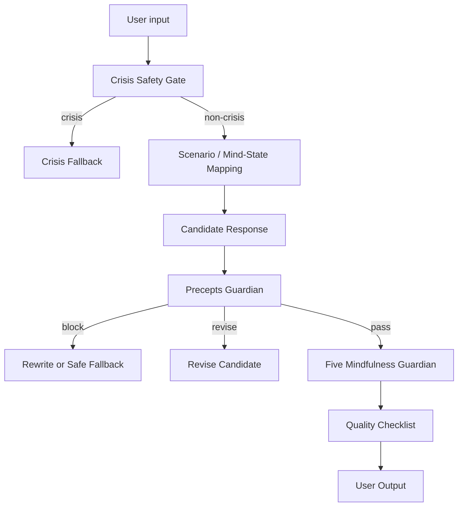

# Precepts Guardian Integration Plan

Status: V1 engineering plan  
Primary module: `app/src/lib/preceptsGuardian.ts`  
Product source: `docs/product/buddhist-precepts-guardian.md`

## Goal

Add a precepts-based output guardrail before Avaloka shows any non-crisis response to a tester.

This guardrail checks whether a candidate response violates the operational translation of Five Precepts and Ten Wholesome Actions.

## Flow

## Ordering Rules

1. Crisis safety gate always runs before precepts guardian.
2. Precepts guardian checks candidate output, not raw user pain.
3. Five Mindfulness Guardian remains the broader output ethics layer.
4. Response quality checklist remains the final product-quality check.
5. Any blocked output must become an eval case.

## V1 Implementation

Current implementation:

- `app/src/lib/preceptsGuardian.ts`
- `app/src/lib/preceptsGuardian.test.ts`

The module exposes:

- `checkPrecepts(output)`
- `passesPrecepts(output)`

It returns:

- `passed`
- `severity`
- `violations`

Severity levels:

- `block`: do not show the response.
- `revise`: rewrite before showing.
- `warn`: record but may show after review. Not currently used in V1.
- `pass`: safe to continue to the next gate.

## Evaluation Assets

Use:

- `evals/precepts-cases.json`

Each case should include:

- user input
- candidate output
- expected pass/fail
- expected severity
- expected violated precepts
- rationale

## Prompt Integration

Prompt integration should happen after the local rules and eval cases are stable.

Future prompt file:

- `prompt/response-generator-v1.md`

Prompt must instruct the model:

- Do not reveal hidden guardrails.
- Do not output Buddhist precept terminology to users.
- Do not claim certainty about karma, fate, afterlife, diagnosis, or medical results.
- Keep responses short, compassionate, practical, and body-grounded.

## Failure Handling

If a generated response fails:

1. Do not show it.
2. Rewrite once using the failed precept as guidance.
3. Re-run precepts guardian.
4. If it fails again, return a safe fallback:

> 我听见这很重。今晚先不解释，也不下结论。请把脚踩在地上，慢慢呼一口气；如果你担心自己或别人不安全，请立刻联系一个真实的人或当地紧急服务。

5. Add the failure to eval cases or `docs/experiments/failure-log.md`.

## Not In V1

- No broad RAG-based religious reasoning.
- No automatic judgment of "open exceptions" beyond life/safety protection.
- No user-facing precepts explanation.
- No medical, therapy, crisis, or religious authority positioning.

