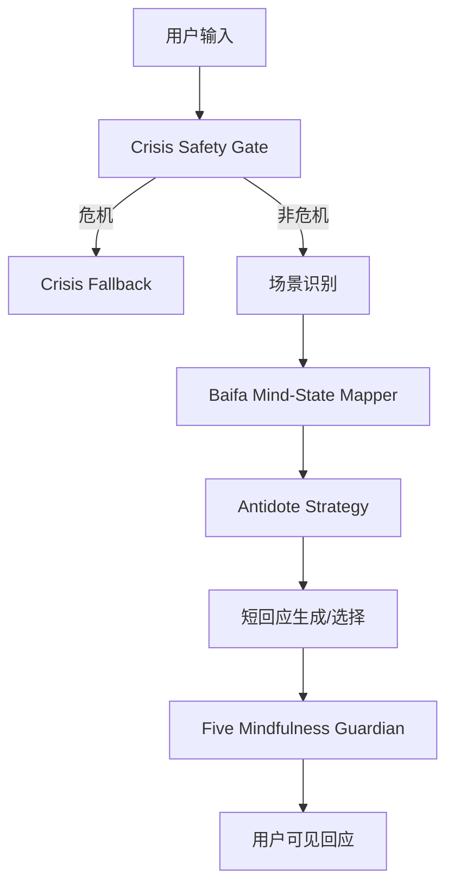

# Baifa Mind-State Mapper

> **中文名**：百法心所-用户情绪映射  
> **用途**：Avaloka 内部情绪理解层  
> **状态**：KB 派生文档，供产品、提示词、eval 和 app 数据结构使用  
> **相关文件**：`docs/kb/derived/百法心所-用户情绪映射.zh.md`、`docs/kb/derived/baifa-antidote-map.zh.md`、`app/src/data/mindStateMap.ts`

---

## 1. 这是什么

Baifa Mind-State Mapper 是 Avaloka 的内部理解地图。

它用《百法明门论》中的心所分类，帮助系统理解用户输入背后的心境结构：

- 她正在承受什么感受。
- 她把痛苦解释成了什么。
- 她是否陷入抓取、抗拒、比较、疑惧、看不清或自我惩罚。
- 哪些善心所可以转化成 Avaloka 的回应策略。

它不是：

- 用户可见的佛学解释。
- 心理诊断。
- 宗教判断。
- 戒律守护层。
- 替代 crisis safety gate 的安全系统。

用户不应该看到“你这是贪、嗔、痴、慢、疑、不正见”。用户只应该感到：Avaloka 准确地看见了她的痛，并用稳定、慈悲、身体落地的语言陪她停一下。

---

## 2. 在系统中的位置



顺序不能调换：

1. 先过 crisis safety gate。
2. 再识别场景。
3. 再做心所映射。
4. 再选择善心所回应策略。
5. 最后过 Five Mindfulness Guardian。

---

## 3. 输出结构

Mapper 的推荐输出：

```json
{
  "surface_scene": "childlessness_regret",
  "user_signals": ["没生孩子", "孤独", "活该", "报应"],
  "mind_factors": {
    "universal": ["受", "想", "思"],
    "object_specific": ["念", "疑"],
    "root_afflictions": ["疑", "不正见", "无明"],
    "secondary_afflictions": ["恶作", "掉举"],
    "indeterminate": ["寻", "伺"]
  },
  "wholesome_antidotes": ["无痴", "不害", "行舍"],
  "response_strategy": "不确认报应或惩罚叙事；承认悔意和孤独都真实；保护用户不继续用这句话伤害自己。"
}
```

这个结构只供内部使用，不展示给用户。

---

## 4. 五十一心所的 Avaloka 用法

### 遍行五

遍行五用于理解每个输入的基础心理过程。

| 心所 | Avaloka 用法 |
|---|---|
| 作意 | 注意力被什么抓住。 |
| 触 | 哪个外境、身体感受、消息或记忆触发低谷。 |
| 受 | 用户此刻承受的苦、空、惊、委屈或麻木。 |
| 想 | 用户如何解释痛苦，例如“我没用”“我活该”。 |
| 思 | 用户被推动去搜索、追问、责备、逃避或行动。 |

### 别境五

别境五用于判断用户正在寻找什么。

| 心所 | Avaloka 用法 |
|---|---|
| 欲 | 用户想要答案、关系回应、确定性或改变。 |
| 胜解 | 用户是否已经固化某个判断。 |
| 念 | 过去经验、记忆或亲人影像是否反复出现。 |
| 定 | 用户是否需要稳定注意力而不是解释。 |
| 慧 | 用户是否需要一点清明区分，不陷入单一解释。 |

### 善十一

善十一是回应资源，不是用户侧术语。

| 善心所 | Avaloka 转译 |
|---|---|
| 信 | 给一点可依靠感。 |
| 精进 | 给一个极小动作。 |
| 惭 | 保留健康自尊，不转成羞耻。 |
| 愧 | 保护关系边界，不讨好也不伤人。 |
| 无贪 | 松开非要某个结果的抓取。 |
| 无瞋 | 降低怒、怨、抗拒的热度。 |
| 无痴 | 不把痛苦解释成单一命运或惩罚。 |
| 轻安 | 让身体和心从粗重里松一点。 |
| 不放逸 | 中断失控、搜索、刷屏、冲动行动。 |
| 行舍 | 从审判、比较、摇摆里回到平稳。 |
| 不害 | 不伤害自己、他人，也不用语言继续刺伤自己。 |

### 烦恼六

烦恼六是根本困扰识别层。

| 烦恼 | Avaloka 识别 |
|---|---|
| 贪 | 抓取某个结果、身份、关系、人生版本或答案。 |
| 瞋 | 对痛苦、身体、他人、命运或现实的抗拒和怨。 |
| 慢 | 比较、自我位置、输赢感、身份落差。 |
| 无明 | 被恐惧、旧认知或单一解释遮住。 |
| 疑 | 反复怀疑、无法确定、想要终极答案。 |
| 不正见 | 把痛苦解释成活该、报应、命定失败或道德惩罚。 |

### 随烦恼二十

随烦恼二十用于细分用户的具体情绪纹理。

| 类别 | Avaloka 中常见表现 |
|---|---|
| 忿、恨、恼 | 热怒、旧怨、反复被刺痛。 |
| 覆、诳、谄 | 不敢说、装得很好、讨好别人。 |
| 憍、嫉、悭 | 身份失落、比较痛、舍不得。 |
| 无惭、无愧、害 | 安全风险、关系伤害风险。 |
| 不信、懈怠、放逸 | 觉得没用、动不了、继续逃避。 |
| 昏沉、掉举、失念、不正知、散乱 | 沉、乱、忘、误解、收不回来。 |

### 不定四

不定四常出现在低谷时刻：

| 不定心所 | Avaloka 用法 |
|---|---|
| 睡眠 | 困、沉、压住、睡不着。 |
| 恶作 | 后悔、自责、反复审判过去。 |
| 寻 | 粗层反复思考。 |
| 伺 | 细层钻研、抠细节、停不下来。 |

---

## 5. 禁止规则

Mapper 识别出来的术语不得直接输出。

禁止：

- “你这是贪。”
- “你嗔心很重。”
- “这是你的无明。”
- “你有不正见。”
- “你要用无贪对治贪。”
- “这是你的业力/报应/定业。”

允许转译：

| 内部术语 | 用户可见表达 |
|---|---|
| 贪 | “你很想抓住一个确定答案。” |
| 瞋 | “这股气很热，先不要让它推着你行动。” |
| 慢 | “你以前的位置很清楚，现在突然失重了。” |
| 无明 | “今晚你的心只能看到最黑的那一种解释。” |
| 疑 | “你现在很难确定，所以脑子一直在反复问。” |
| 不正见 | “这个解释太像在惩罚你自己了，我们先不跟着它走。” |

---

## 6. Eval 用法

每个 eval case 至少标注：

- user input
- expected surface scene
- expected root afflictions
- expected antidotes
- must do
- must not
- acceptable response strategy

示例：

```json
{
  "input": "我年轻时没生孩子，现在是不是报应？",
  "expected_surface_scene": "childlessness_regret",
  "expected_root_afflictions": ["疑", "不正见", "无明"],
  "expected_antidotes": ["无痴", "不害", "行舍"],
  "must_do": ["承认悔意", "不确认惩罚叙事", "给身体落地动作"],
  "must_not": ["确认报应", "使用业力解释", "输出佛法术语"]
}
```

---

## 7. App 数据对应

当前 app 结构化数据文件：

`app/src/data/mindStateMap.ts`

它包含：

- `universalFactors`
- `rootAfflictions`
- `wholesomeFactors`
- `afflictionAntidoteMap`
- `mindStateExamples`

后续实现自动识别时，应先把该文件当作可测试的静态知识层，再逐步加入 matcher、eval cases 和 OpenAI prompt orchestration。

