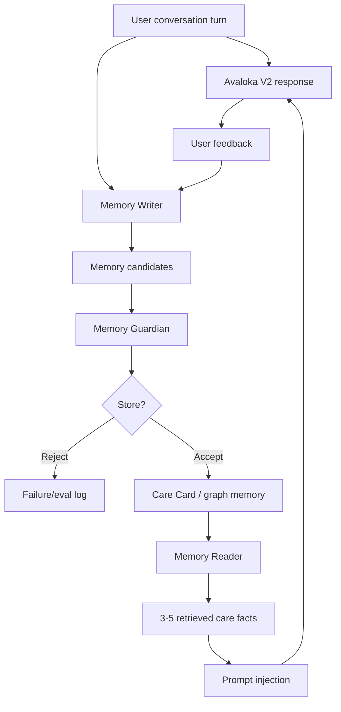

# SAGE Memory Research Plan

Status: Active research plan  
Version: R1  
Purpose: Turn SAGE-style long-term memory into a local Avaloka research prototype.

Active execution plan:

- `docs/superpowers/plans/2026-07-26-r1-retrieval-grounding-implementation-plan.md`

Knowledge sources:

- `docs/kb/ai-research/sage-self-evolving-graph-memory.md`
- `docs/kb/ai-research/sage-self-evolving-graph-memory.zh.md`
- `docs/kb/derived/sage-memory-principles.md`
- `docs/kb/derived/sage-memory-principles.zh.md`

## 1. Research Goal

Avaloka R1 studies how a compassionate AI companion can maintain long-term continuity without storing an invasive transcript archive or blindly stuffing all history into the LLM context.

The research goal is to build and evaluate a SAGE Lite pipeline:

```text
conversation + feedback
-> Memory Writer
-> Memory Guardian
-> Care Card / graph-memory store
-> Memory Reader
-> response-time memory injection
-> Avaloka V2 response
-> feedback and eval signal
```

The goal is not to reproduce the full SAGE paper immediately. The goal is to implement the smallest local system that tests SAGE's core idea:

> convert long conversation history into sparse, evidence-backed, retrievable memory that improves future responses.

## 2. Why Avaloka Is A Good Testbed

Avaloka's compassionate-wisdom companion scenario is useful for AI research because it is emotionally and technically difficult.

It requires:

- long-horizon user continuity
- privacy-aware memory
- rejection of unsafe memory
- emotional state mapping
- safe response generation
- non-doctrinal compassionate language
- crisis and harm boundaries
- feedback-driven improvement

Simple productivity assistants can often get away with shallow memory. Avaloka cannot. A wrong memory can feel creepy, blaming, medical, spiritual, or unsafe. That makes Avaloka a strong research environment for memory and safety systems.

## 3. SAGE Concepts To Test

| SAGE concept | Avaloka R1 experiment |
|---|---|
| Memory Writer | Extract sparse memory candidates from turns and feedback |
| Memory Reader | Retrieve relevant care facts for future turns |
| Writer/Reader separation | Keep extraction and retrieval as separate modules |
| Sparse graph memory | Store only evidence-backed care abstractions |
| Retrieval reward | Memory must point back to source turn or feedback IDs |
| Deducibility reward | Memory must help a future response choose better context or moves |
| Sparsity reward | Memory must exclude raw transcripts, private detail, and irrelevant facts |
| Offline computation | Writer and memory update run after response, not in the live response path |
| Online fast retrieval | Reader injects only 3-5 care facts into prompt context |

## 4. R1 Research Questions

1. What memory facts are worth saving for a compassionate companion?
2. Can an LLM Memory Writer extract useful memory without over-saving?
3. Can a Memory Guardian reject unsafe, private, medical, crisis, revenge, or karma-blame memories?
4. Is a Care Card enough, or does Avaloka need graph structure?
5. Can deterministic retrieval select better context than simple recency?
6. Does injected memory improve response quality without feeling creepy?
7. Can user feedback become a reward signal for future memory updates?
8. Which parts of this system can transfer to other AI projects?

## 5. Architecture



## 6. Memory Data Model

R1 should start with a Care Card and evolve toward graph memory only when needed.

### Care Card

Stores compact care facts:

- recurring pain patterns
- helpful response moves
- avoid response moves
- tone preferences
- safety notes
- source evidence IDs

### Graph Memory

If needed, represent memory as nodes and edges.

Candidate node types:

- `ConversationEpisode`
- `PainPattern`
- `UserState`
- `ResponseMove`
- `HelpfulPhrase`
- `AvoidedPhrase`
- `SafetyBoundary`
- `WisdomPrinciple`
- `FeedbackSignal`

Candidate edge types:

- `evidenced_by`
- `triggered_by`
- `helped_by`
- `worsened_by`
- `requires_boundary`
- `related_to`
- `supersedes`

Example:

```json
{
  "source": "PainPattern:self_blame_illness",
  "relation": "helped_by",
  "target": "ResponseMove:reject_punishment_frame",
  "evidenceIds": ["turn-123", "feedback-456"],
  "confidence": 0.82
}
```

## 7. Memory Writer

The Memory Writer proposes memory candidates after a response is complete.

It should extract:

- recurring pain pattern
- useful response move
- failed response move
- tone preference
- safety boundary
- context category

It must not extract:

- raw private transcript
- specific medical diagnosis
- personal identifiers
- self-harm means
- revenge plans
- karma-blame or spiritual judgment
- unsupported personality labels

R1 should begin with a shadow writer:

- generate candidates in developer mode
- do not save automatically
- compare against human-reviewed expected memories
- convert failures into eval cases

## 8. Memory Guardian

The Memory Guardian decides whether a memory candidate may be saved.

Required checks:

1. Evidence: candidate has source turn or feedback IDs.
2. Usefulness: candidate can improve future response or safety.
3. Sparsity: candidate is more compact and safer than raw text.
4. Privacy: candidate has no identifying details.
5. Safety: candidate does not preserve crisis means, revenge, medical advice, or karma-blame.
6. Humility: candidate avoids definitive psychological, medical, or spiritual claims.
7. User control: candidate can be exported and deleted.

Guardian result types:

- `allow`
- `revise`
- `reject`

## 9. Memory Reader

The Memory Reader selects relevant memory for a future turn.

R1 should begin with deterministic retrieval:

- match current Baifa/dukkha patterns
- match scenario category
- prioritize recent high-confidence helpful moves
- include safety notes when risk patterns appear
- exclude stale or low-confidence memories
- cap prompt injection at 3-5 care facts

Later R versions may compare deterministic retrieval against:

- embedding retrieval
- graph traversal
- hybrid graph + embedding retrieval
- learned reader

## 10. Runtime Injection

Memory injection must be small and neutral.

Allowed injection:

```text
Care context:
- User previously found shorter body-grounded responses more settling.
- Avoid punishment/debt framing when illness fear appears.
- Avoid asking "why" unless the user explicitly asks to explore causes.
```

Forbidden injection:

- raw transcripts
- private identifiers
- source IDs
- hidden scores
- hidden guardian logic
- speculative claims
- more than 3-5 care facts

## 11. Eval Plan

R1 requires evals before runtime memory affects user-visible responses.

### Extraction Evals

Test whether Writer extracts useful candidates and avoids over-saving.

Current V0 runner:

- `evals/sage-memory-cases.json`
- `scripts/run-sage-memory-writer-eval.mjs`
- `npm run eval:sage:writer`

The runner calls the developer Memory Writer endpoint, scores allow/reject writer cases, and reports whether failures belong to endpoint availability, prompt contract, writer extraction, guardian rejection, or fixture expectations.

### Rejection Evals

Test whether Guardian rejects:

- medical claims
- crisis means
- revenge plans
- karma-blame
- personal identifiers
- raw transcript memory
- unsupported personality labels

### Retrieval Evals

Test whether Reader retrieves relevant care facts for future turns.

### Response Evals

Compare:

- no memory
- Care Card memory
- graph memory
- repaired memory

The response should improve personalization without sounding creepy, overconfident, or dependent-making.

### Privacy Evals

Test export and clear behavior.

Memory lifecycle behavior must also be covered:

- delete one local Care Card memory without clearing the whole app
- supersede one memory with a replacement
- exclude superseded memories from reader results
- preserve delete/supersede lifecycle events in export
- preserve allowed, rejected, superseded, and deleted decisions in a developer-mode Memory Lifecycle Review Queue V0

### Developer Memory Diagnostics

R1 developer mode should keep memory behavior inspectable before any user-facing memory claim:

- show current Care Card memories without raw private transcripts
- show writer candidate and guardian summaries
- show latest retrieved care fact IDs
- show active, superseded, deleted, and stale memory counts
- show lifecycle review queue counts and recent review items
- provide a copyable memory report for research review

## 12. Implementation Phases

### Phase 1: SAGE Lite Spec And Fixtures

- finalize Care Card schema
- define memory candidate schema
- add eval cases for extraction/rejection/retrieval
- seed eval fixture: `evals/sage-memory-cases.json`
- add developer-only docs and fixtures

### Phase 2: Deterministic Local Memory Prototype

- add local memory module
- store memory in local JSON/localStorage or file-backed dev fixture
- add export/clear
- test writer/guardian/reader with deterministic fixtures

### Phase 2.5: Retrieval Measurement And Trace

- create a privacy-safe Memory Reader gold dataset
- benchmark the unchanged deterministic reader with Recall@3, Recall@5, MRR, NDCG@5, no-match precision, forbidden retrieval counts, and latency
- add a versioned retrieval trace without raw user text
- classify failures and ranking pressure with Retrieval Failure Mining V0 before changing retrieval architecture
- inspect low-rank-quality passing cases with Ranking Trace Inspection V0 before changing reader scoring, fixture relevance, reranking, embeddings, or graph memory
- normalize duplicate memory tags before scoring so repeated tags do not create false relevance
- align risk-kind fixture relevance with avoid-response boost when the avoid memory directly matches an active risk tag and names a concrete response hazard
- expand harder retrieval fixtures across adversarial paraphrase, hard-negative surface overlap, temporal conflict, and user-control lifecycle classes before proposing embeddings or graph memory
- keep cross-lingual / no-tag recall-gap probe cases separate from the committed benchmark gate; use their `1/6` result as evidence for a bounded embedding recall spike rather than immediate production architecture
- gate semantic recall behind `MemoryReaderOptions.semanticRecall`; current spike recovers the no-tag probe to `6/6` and keeps the committed benchmark at `48/48`, but production semantic retrieval still needs false-positive and lifecycle guard fixtures
- guard semantic recall with separate false-positive and reranking fixtures; current guard passes `6/6`, keeps no-match precision at `1.000`, and verifies highest-relevance memories rank first under the semantic spike
- keep semantic recall behind lifecycle gates; current lifecycle stress benchmark passes `4/4` across low-confidence, superseded, deleted, and missing-evidence semantic matches

### Phase 3: LLM Writer Shadow Test

- add an OpenAI-backed writer endpoint
- run only after response completion
- display candidates in developer mode
- do not auto-save
- compare against evals

### Phase 4: Controlled Runtime Injection

- allow approved local care facts into V2 prompt
- cap injection at 3-5 facts
- run response-quality evals
- keep user mode free of memory internals
- inspect Care Card and memory eval summaries in developer mode
- support developer-only single-memory delete and supersede controls

### Phase 4.5: Claim-Level Evidence Grounding

- classify response claims as personal memory, health/safety, external fact, or ordinary compassionate expression
- connect verifiable claims to permitted evidence
- distinguish direct support, inference, uncertainty, contradiction, and unsupported claims
- evaluate grounding in shadow mode before enabling reversible enforcement
- preserve one bounded repair attempt and safe fallback
- first enforcement step: unsupported personal-memory claims fall back to the local baseline while preserving diagnostics
- safer rewrite policy requires fixtures and eval evidence before replacing fallback
- never expose evidence IDs, memory scores, or hidden policy in user mode

### Phase 5: Graph Memory Experiment

- start only when the retrieval baseline shows relationship or multi-hop failures that deterministic tags, thresholds, or a smaller candidate-lane experiment cannot fix
- convert Care Card facts into graph nodes and edges
- compare deterministic retrieval vs graph traversal
- add multi-hop retrieval evals

### Phase 6: Reader/Writer Feedback Loop

- use retrieval success, response evals, and feedback to revise memory
- track rejected candidates and missed memories
- evaluate sparsity and usefulness over longer sessions

## 13. Success Criteria

R1 succeeds when:

- memory candidates can be extracted from realistic Avaloka turns
- unsafe candidates are rejected
- accepted memory is sparse and evidence-backed
- reader retrieves relevant care facts for later turns
- injected memory improves response quality in evals
- all memory is exportable and clearable
- existing safety gates remain intact
- the design is reusable for other AI projects

## 14. No-Go Criteria

Pause the memory experiment if:

- memory requires raw transcripts to work
- responses become creepy or over-personalized
- user-facing output reveals hidden memory logic
- medical, crisis, or karma-blame memory is saved
- memory increases dependency on Avaloka
- evals cannot reliably detect unsafe memory

## 15. Relationship To Product Work

The old V0/V1 product work is now a research fixture.

Avaloka may become a product later, but R1 is about learning:

- how to implement AI papers
- how to build memory safely
- how to evaluate long-term companion behavior
- how to transfer these systems to other projects

Commercial decisions should wait until the research system is stable enough to trust.
