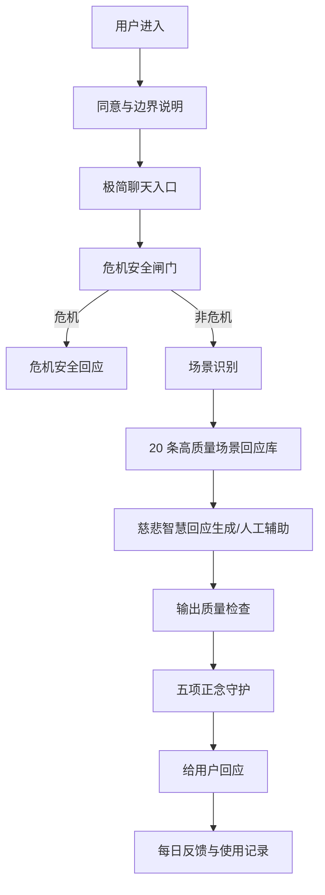
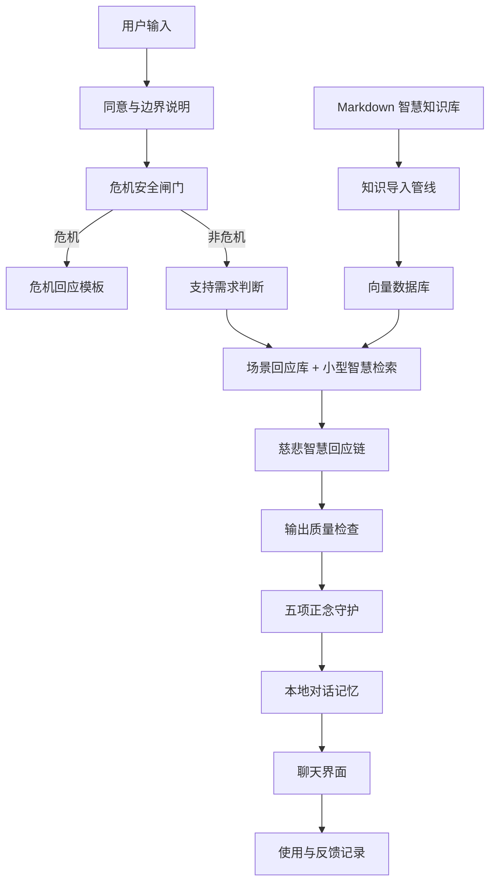

# Avaloka AI 系统模块说明

日期：2026-05-13

状态：Historical V0/V1 system module reference；已被 2026-05-26 R1 研究方向取代

R1 说明：本文保留为早期系统模块解释。当前 active architecture 以 `docs/research/sage-memory-research-plan.md`、`docs/engineering/avaloka-memory-engine-v1.md` 和 `docs/engineering/ai-production-safety-harness.md` 为准。

## 1. 这份文档解决什么问题

这份文档解释 Avaloka AI 系统图里的每个模块分别做什么、为什么需要它、它要防止什么问题。

Avaloka v1 的目标不是做一个知识问答机器人，也不是做心理治疗产品。第一版只服务一个核心需求：

> 当用户处在孤独、恐惧、衰老、病痛、死亡焦虑、无子遗憾、意义崩塌等真实低谷时，Avaloka 用私密、稳定、慈悲、有智慧的方式接住她，并帮助她回到一个清明的下一步。

用户看到的是“被理解”和“被安顿”。系统背后要做的是：边界说明、安全判断、支持需求判断、回应生成、伦理守护、反馈记录。

## 2. 总体流程

Avaloka 现在应该有两张系统图，而不是一张。

### 2.1 7 天免费验证流程

第一阶段要验证真实使用，不要过早做完整 RAG、向量库和长期记忆。

### 2.2 完整 MVP 流程

7 天测试有正向信号后，再进入完整本地 MVP。

## 3. 模块零：同意与边界说明

### 解决的问题

Avaloka 会接触非常私密、脆弱甚至高风险的情绪内容。用户必须先知道它能做什么、不能做什么。

### 目的

建立清楚边界，防止用户把 Avaloka 误解为医疗、心理治疗或危机服务。

### v1 要求

- 首次使用前展示简短说明。
- 明确 Avaloka 是私人情绪疏导陪伴工具。
- 明确它不提供诊断、治疗、医疗建议或危机干预。
- 明确危机场景应联系现实中的可信赖的人、专业人员或当地紧急服务。
- 明确 7 天测试会记录使用反馈，并允许用户停止或要求清除记录。

### 成功标准

用户理解 Avaloka 是陪伴工具，而不是治疗工具。

## 4. 模块一：聊天界面

### 解决的问题

用户需要一个低压力、私密、安静的入口，而不是一个复杂 App。

### 目的

让用户可以在情绪低谷时直接写下真实感受。界面不应该像课程平台、知识库或社交产品。

### v1 要求

- 一个简单输入框。
- 显示 Avaloka 的回应。
- 可选显示“今天的安顿练习”。
- 不做复杂导航、账号系统、内容广场或社群。

### 成功标准

用户在深夜或低谷时不需要学习产品怎么用，打开就能倾诉。

## 5. 模块二：危机安全闸门

### 解决的问题

当用户有自伤、自杀、伤害他人、急性崩溃或现实危险时，普通陪伴回应是不够的，也可能有风险。

### 目的

在任何智慧回应之前，先判断是否需要进入安全流程。

### 触发场景

- “我不想活了。”
- “我想伤害自己。”
- “我怕我会做出极端的事。”
- “我现在控制不住自己。”
- “我想报复某个人。”

### 系统行为

一旦触发危机安全闸门：

- 停止普通 Avaloka 回应链。
- 不做智慧解释。
- 不使用因果、命运、修行等解释。
- 直接鼓励用户联系现实中的人、专业人员或当地紧急服务。
- 语气温暖、明确、紧急。

### 边界

危机安全闸门不是五项正念守护。它是更早、更硬的安全边界。

## 6. 模块三：支持需求判断

### 解决的问题

用户说出来的话常常不是痛苦本身，而是痛苦的表层。例如“我没有孩子”背后可能是孤独、羞耻、死亡恐惧、无人照应、生命意义感崩塌。

但这个模块不能变成心理诊断。它不判断用户“是什么病”，只判断用户此刻需要哪种支持。

### 目的

把用户输入拆成几个维度：

- 表层事件是什么。
- 当前痛苦主题是什么。
- 深层恐惧或未被满足的需要是什么。
- 用户此刻需要稳定、倾听、澄清、陪伴，还是现实求助。
- 回应语言是否需要更短、更稳、更低刺激。

### 输出

这个模块不直接面向用户。它给后面的回应链提供结构化上下文。

示例：

- 事件：身体不适，想到未来无人照顾。
- 痛苦主题：恐惧、孤独。
- 深层主题：衰老、死亡、无依靠。
- 此刻需要：稳定神经系统、被看见、一个当晚可执行的小行动。

## 7. 模块四：场景回应库与智慧检索

### 解决的问题

如果没有知识支撑，AI 容易变成泛泛安慰；如果直接背诵知识，又会变成教条。

### 目的

7 天验证阶段先用 20 条高质量场景回应库，保证回答能接住目标用户的核心场景。

完整 MVP 阶段再从本地知识库中检索与用户痛苦相关的智慧材料，作为回应的底层支撑。

### 重要原则

场景回应库和智慧检索都是后台能力，不是前台表演。

Avaloka 不应该满口术语，也不应该用宗教语言压过用户的痛苦。它可以吸收智慧，但输出必须是生活语言、慈悲语言、稳定语言。

## 8. 模块五：慈悲智慧回应链

### 解决的问题

通用 AI 常常正确但冷；朋友常常有好心但没有智慧；灵性内容常常有道理但不能针对个人处境。

### 目的

生成一条真正能接住人的回应。

### 推荐回应结构

1. **听见**：先承接情绪，不急着解释。
2. **照见**：温柔指出痛苦背后的恐惧、执着或需要。
3. **转念**：用朴素语言提供一个新的看法。
4. **行持**：给一个 1-3 分钟能做的小练习。

### 禁止风格

- “你应该放下。”
- “这都是你的业。”
- “你想太多了。”
- “凡所有相皆是虚妄，所以别痛苦。”
- 长篇教义背诵。
- 像心理咨询模板一样机械。

## 9. 模块六：输出质量检查

### 解决的问题

AI 可能生成看似温柔但实际无效、空泛、说教或过长的回答。

### 目的

在输出前检查回答是否符合 Avaloka 的产品体验。

### 检查项

- 是否先承接情绪。
- 是否避免命令式语言。
- 是否只给一个可执行练习。
- 是否避免过度宗教化。
- 是否避免泛泛鸡汤。
- 是否没有医疗、诊断或治疗承诺。

## 10. 模块七：五项正念守护

### 解决的问题

产品必须有隐藏伦理底线。它不能为了“安慰用户”而鼓励伤害、逃避、依赖、报复、羞辱或精神绕过。

### 目的

五项正念守护是 Avaloka 的后台伦理过滤器。用户不一定看到这五条，但每个非危机回应都必须通过它们。

### 五项检查

1. **尊重生命**：不鼓励自伤、伤害他人、报复、非人化或暴力。
2. **真正的幸福**：不把财富、地位、控制、惩罚、外在认同说成解脱来源。
3. **真爱**：不鼓励胁迫、依赖、操控、剥削或越界关系。
4. **爱语和深度聆听**：不羞辱、不轻视、不冷冰冰说教、不制造对立。
5. **滋养和疗愈**：不鼓励逃避性消费、沉溺、成瘾、反刍或精神绕过。

### 如果不通过

系统要重写回答。若仍然无法通过，则输出一个安全、简短、稳定的 fallback 回应。

## 11. 模块八：使用与反馈记录

### 解决的问题

7 天测试的目标是得到行为证据。如果没有记录模块，测试结束后只能依赖印象。

### 目的

记录用户是否真的在低谷时使用，以及回应是否真的带来安顿。

### v1 记录内容

- 是否主动打开。
- 是否真实低谷，而不是为了测试。
- 场景类型。
- 回应安顿评分，1-5 分。
- 最有帮助的一句话。
- 让用户觉得冷、泛泛、不对或不安全的一句话。
- 明天是否还想继续。
- 第 7 天是否希望继续免费使用。

### 成功标准

7 天后能用真实记录更新商业书，而不是只靠创始人的感觉。

## 12. 模块九：本地对话记忆

### 解决的问题

陪伴感来自连续性。用户不希望每次都从零解释自己是谁、怕什么、正在经历什么。

### 目的

记录必要的对话上下文，让 Avaloka 能在下一次回应中更贴近用户。

### v1 只记录最小信息

- 用户反复出现的痛苦主题。
- 用户偏好的安顿方式。
- 用户不喜欢的表达方式。
- 最近几次低谷场景。

### 隐私原则

第一版优先本地存储。不要过早做云端账号和共享数据。

## 13. 模块十：Markdown 智慧知识库

### 解决的问题

Avaloka 需要稳定的价值和语言来源，避免每次只靠模型自由发挥。

### 目的

用少量高质量文档支撑回应生成。

### v1 内容类型

- 情绪场景说明。
- 高质量示例回应。
- 安全边界说明。
- 五项正念守护原则。
- 语言风格指南。

### 注意

知识库不是越大越好。v1 重点是高质量、可控、能通过用户测试。

## 14. 模块十一：知识导入管线

### 解决的问题

Markdown 文档需要被切分、清洗、向量化，才能被检索。

### 目的

把知识库变成模型可以检索的材料。

### v1 要求

- 读取 Markdown。
- 按段落或小节切分。
- 保留标题和来源。
- 写入向量数据库。

## 15. 模块十二：向量数据库

### 解决的问题

用户输入是自然语言，系统需要找到语义相关的知识，而不是只靠关键词匹配。

### 目的

存储知识片段的向量，并根据用户输入取回最相关内容。

### v1 选择

可以使用 Chroma 或类似本地向量库。优先简单、可本地运行、易调试。

## 16. 模块十三：本地模型

### 解决的问题

Avaloka 涉及非常私密的情绪内容。第一版应尽量降低隐私风险。

### 目的

使用本地 LLM 生成回应，减少敏感内容外发。

### v1 原则

- 优先本地运行。
- 不追求最强模型。
- 先验证产品体验和用户需求。
- 如果未来使用云模型，必须重新设计隐私和安全说明。

## 15. 最重要的系统判断

Avaloka 的系统价值不在某一个模块，而在这些模块的顺序：

1. 先说明边界。
2. 再安全判断。
3. 再判断支持需求。
4. 再选择场景回应或检索材料。
5. 再生成回应。
6. 再做输出质量检查。
7. 再通过五项正念守护。
8. 最后记录反馈和必要记忆。

如果顺序错了，产品会变成危险、说教、冷漠或不可信的 AI。
