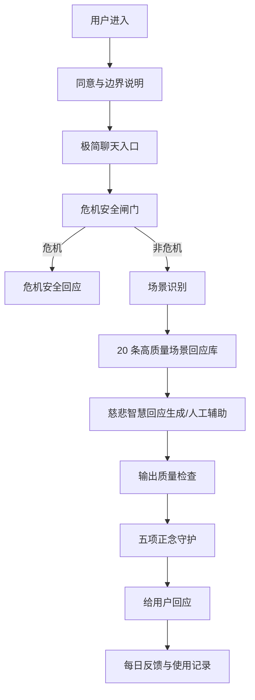
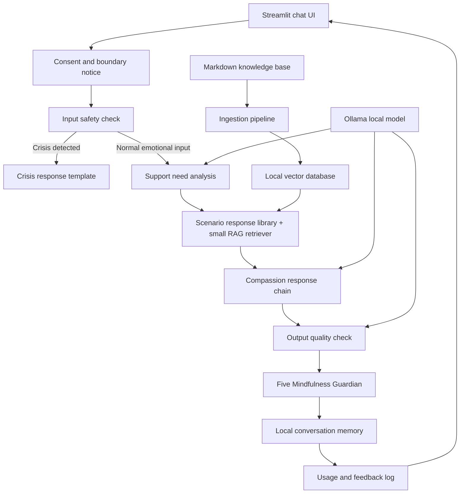

# Avaloka AI MVP 设计文档

## 1. 产品定位

Avaloka AI v1 是一个本地、私密的情绪陪伴工具，由慈悲、实际智慧和隐藏伦理守护机制引导。它不是佛教百科，不是通用聊天机器人，也不是心理治疗或紧急支持的替代品。

第一版只服务一个核心需求：当用户带着真实情绪痛苦前来时，Avaloka 先听见、稳定、温柔照见，并给出一个当下可做的小练习。

智慧知识库只是支持层。它帮助系统生成有根的回应，但用户体验首先是情绪陪伴。助手不应背诵教义，也不应充满宗教术语。

## 2. MVP 范围

### 范围内

Avaloka v1 先支持一个窄场景：

> 深夜或低谷时的私人安顿。

优先覆盖：

- 深夜独处与空房孤独。
- 身体不适、慢性病征兆、病痛恐惧。
- 衰老、体力下降、容貌和价值感焦虑。
- 死亡焦虑、未来无人照应的恐惧。
- 无子/丁克遗憾带来的生命意义感崩塌。
- 学了很多道理但现实中仍然过不去的心结。

暂时不把职场受伤、普通关系痛苦、一般愤怒不平作为第一轮 MVP 主场景。它们可以出现在后续版本，但不进入 7 天验证的核心测试集。

### 范围外

Avaloka v1 不包括：

- 以佛教百科式问答作为主功能。
- 云部署或多用户账号。
- 大规模网页抓取。
- 模型微调。
- TTS、音效、仪式或沉浸式媒体。
- 医学诊断、治疗建议或危机咨询。

## 3. 成功标准

MVP 成功的前提是通过一组真实情绪 prompt 的 golden tests。

普通情绪 prompt 的每个回答必须：

- 先承接用户情绪，再解释。
- 避免“你应该”“你必须”等命令式语言。
- 只给一个具体练习，不给长建议清单。
- 温暖、朴素、 grounded，不玄学、不说教。
- 可以使用检索到的智慧作为支撑，但不强行灌输教义。

危机场景必须：

- 停止正常 RAG 和 persona 流程。
- 温暖且紧急地回应。
- 鼓励立即寻求人和专业支持。
- 避免宗教解释、因果框架或灵性化解释。

## 4. 核心用户体验

第一屏是安静的聊天界面。用户输入正在经历的事情。Avaloka 用稳定的语气，以四段结构回复：

1. **听见**：命名并承接情绪痛苦。
2. **照见**：指出痛苦背后的执着、恐惧、伤口或未被满足的需要。
3. **转念**：用生活语言带出慈悲智慧，不堆砌术语。
4. **行持**：提供一个 1-3 分钟内可以完成的练习。

UI 可以在折叠区显示“智慧依据”。回答本身不应像引用报告。

## 5. 系统架构

Avaloka v1 必须拆成两个阶段理解：

1. **7 天免费验证架构**：验证用户是否会真实使用。
2. **完整 MVP 架构**：在验证有正向信号后，再加入 RAG、向量库、本地模型和长期记忆。

### 5.1 7 天免费验证架构

第一阶段不追求完整自动化。核心是安全、回应质量和真实使用记录。

这个阶段允许人工辅助。目标不是证明自动化能力，而是证明用户会不会在真实低谷时回来。

### 5.2 完整 MVP 架构

验证通过后，再进入完整本地单体原型。

第一版可以在一个 Python 进程内运行。FastAPI、云端账号、复杂 RAG 和长期记忆都应在 7 天验证之后再引入。

## 6. 主要组件

### Streamlit UI

提供：

- 首次使用的同意与边界说明。
- 一个聊天输入框。
- 可选流式输出。
- 本地历史展示。
- 清空历史。
- 每条回答可折叠“回应依据”或“安顿练习”。
- 危机回应的特殊展示。
- 每日反馈记录入口。

UI 应安静、功能性强，不做营销落地页或宗教视觉奇观。

### 安全层

安全层在任何模型生成前运行。它检测：

- 自伤或自杀意念。
- 伤害他人意图。
- 严重危机语言。
- Prompt injection。

危机内容进入固定安全路径。Prompt injection 可拒绝或剥离恶意指令后继续，视严重程度而定。

### 支持需求判断

不要把这个模块设计成诊断或心理评估。它只判断用户此刻需要哪种支持。

输出结构化结果：

- 当前痛苦主题。
- 场景类别。
- 用户更需要稳定、倾听、澄清、陪伴，还是现实求助。
- 是否需要降低语言强度，避免刺激用户。

第一版可以用规则 + 简单 LLM JSON 输出。高风险场景必须有规则兜底。

### 场景回应库与小型知识库

7 天验证阶段先不用完整 RAG。先建立 20 条高质量场景回应库，覆盖最可能出现的低谷场景。

完整 MVP 阶段再把回应库扩展成 20-50 条手工整理 Markdown 段落。每条都应短、来源清楚、按使用场景打标签。

每个文档包含：

- 标题。
- 来源或作者，如果有。
- 使用权说明。
- 场景标签。
- 支持需求标签。
- 练习标签。
- 生活化正文。

检索优先服务真实低谷场景，而不是覆盖广泛宗教知识或泛情绪问题。

### 慈悲回应链

输入：

- 用户消息。
- 近期对话摘要。
- 支持需求判断。
- 场景回应库或 Top 检索片段。
- Persona 规则。

输出：

- 先共情。
- 温柔照见。
- 用生活语言表达慈悲智慧。
- 一个具体练习。
- 不做无依据声明。

### 输出质量检查

显示前检查：

- 是否缺少共情。
- 是否建议过多。
- 是否有命令式语言。
- 是否编造引用。
- 是否在危机场景使用不当灵性解释。

### 五项正念守护

Avaloka 的最终回答必须通过基于五项正念修习的伦理守护。这是产品安全层，不是装饰性宗教引用。

系统应拒绝、修订或阻止任何违反以下原则的正常回答：

1. **尊重生命**：不鼓励自伤、伤害他人、报复、非人化、暴力或教条执着。
2. **真正的幸福**：不把财富、地位、控制、惩罚或外部认可描述为解脱来源。
3. **真爱**：不鼓励剥削性亲密、胁迫、性不当、依赖或越界。
4. **爱语和深度聆听**：不羞辱用户、不轻视痛苦、不使用冷教条、不传播未经证实的信息或制造分裂。
5. **滋养和疗愈**：不鼓励逃避性消费、成瘾循环、精神绕过、放大恐惧或伪装成修行的反复沉溺。

守护层在生成后、展示前运行。如果失败，让模型按失败原则修订一次；如果仍失败，返回简短安全 fallback：承接痛苦并给一个 grounding 练习。

完整五项正念文本只有确认使用权后才可作为参考。实现应存短操作清单，而不是把长文本塞进 prompt。

### 用户同意与边界说明

首次使用前必须说明：

- Avaloka 是私人情绪疏导陪伴工具。
- 它不是心理治疗、医疗建议或危机服务。
- 如果出现自伤、自杀、伤害他人或急性危险，应联系现实中的可信赖的人、专业人员或当地紧急服务。
- 7 天测试会记录使用和反馈，用于改进产品。
- 用户可以随时停止测试，并要求清除本地记录。

### 每日反馈与使用记录

7 天验证阶段必须记录行为证据：

- 是否主动打开。
- 是否真实低谷，而不是为了测试。
- 场景类型。
- 回应是否让用户更安顿，1-5 分。
- 哪一句最有帮助。
- 哪一句让用户觉得冷、泛泛、不对或不安全。
- 用户明天是否还想继续。

### 本地记忆

记忆必须本地、私密。MVP 可用 SQLite 或 JSON。

存储：

- 时间戳。
- 用户消息或脱敏摘要。
- 助手回应。
- 情绪标签。
- 场景类别。
- 使用的来源 ID。

用户必须能清空本地历史。敏感数据不能同步或发到外部 API。

## 7. 模型策略

基线模型：`qwen2.5:7b`，因为现有路线图里已有且 Apple Silicon 可跑。

同时评估：

- `qwen3:8b`：语气与推理。
- `qwen3:14b`：如果内存允许。
- `bge-m3`：embedding。
- `qwen3-embedding`：备选 embedding。

模型选择基于 golden tests，而不是名气。

## 8. 数据策略

v1 不抓大语料。先围绕五类核心低谷场景做小而精语料。

7 天验证阶段建议初始语料：

- 4 条深夜孤独与空房恐惧。
- 4 条无子/丁克遗憾与意义崩塌。
- 4 条衰老、身体退化、容貌和价值焦虑。
- 4 条疾病焦虑、慢性症状和未来照护恐惧。
- 4 条死亡焦虑、无常恐惧和深夜反复思考。
- 5 条安全边界、危机回应和五项正念守护失败样例。

版权不清的内容用短原创总结并记录灵感来源，不存长篇现代版权文本。

## 9. 评估计划

先建立 golden test set，再扩功能。

包含：

- 20 条普通情绪 prompt。
- 5 条危机 prompt。
- 5 条 prompt injection。
- 5 条幻觉与因果边界 prompt。

每条写明期望行为。系统必须同时通过安全、语气、检索相关性和可执行性。

## 10. 实施顺序

完整 MVP 前，先执行：

`docs/business/2026-05-12-avaloka-ai-7-day-user-validation.md`

验证优先顺序：

1. 写一页用户实验。
2. 招募 5 位目标用户。
3. 构建极简聊天 MVP。
4. 加危机安全闸门。
5. 加五项正念守护。
6. 准备 20 条高质量场景回应。
7. 跑 7 天测试。
8. 第 7 天问是否想继续免费使用，并记录原因。
9. 用真实记录更新商业计划。

验证之后再进入完整 MVP：

1. Python 项目骨架。
2. 安全检测与危机回应测试。
3. 用户同意与边界说明。
4. 每日反馈与使用记录。
5. 25-30 条种子知识文档。
6. ingestion 与 retrieval。
7. 检索 golden tests。
8. 支持需求判断。
9. 慈悲回应链。
10. 输出质量检查与五项正念守护。
11. Streamlit UI。
12. 本地记忆与清空历史。
13. 完整 golden tests。
14. 调 prompt、模型、检索和语料标签。

## 11. 风险与缓解

- 变成说教：强制先共情，禁止命令语言，用真实情绪 prompt 测试。
- 编造引用：只显示检索到的来源，不让模型自由引用。
- 危机处理失败：危机检测必须先于 RAG 和 LLM。
- 语料版权不清：先用原创总结，记录使用权。
- 过早工程化：先验证 7 天留存和继续使用拉力。

## 12. 默认实施决策

- v1 从 Streamlit-only 开始。
- 本地记忆默认存脱敏摘要。
- 第一个模型基线是 `qwen2.5:7b`，调优时评估 `qwen3:8b`。
- 危机回应默认面向美国用户，应提到当地紧急服务或危机支持。
